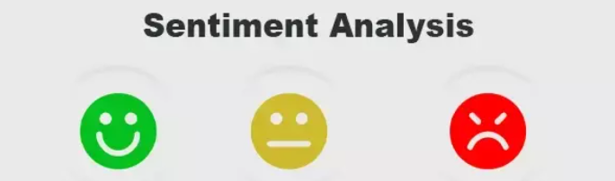

  

# 🧠 Analyse NLP sur la discrimination raciale via Twitter

---

## 🎯 Problématique

**Comment aider les chercheurs et les décideurs à identifier et mettre en œuvre des pratiques fondées sur des données pour lutter contre la discrimination raciale ?**

---

## 🎓 Objectif du projet

Ce projet vise à :

- Identifier et collecter des rapports de discrimination en France via Twitter
- Proposer un outil d’analyse basé sur le NLP
- Évaluer l’efficacité de différents modèles de machine learning pour la prédiction des sentiments

---

## 🛠️ Solution proposée

1. **Collecte des données** :  
   - Scraping de tweets via l’API Twitter en utilisant une liste de mots-clés ciblés.
2. **Prétraitement des textes** :  
   - Nettoyage, tokenisation, vectorisation (TF-IDF).
3. **Stockage des données** :  
   - Utilisation d’une base de données NoSQL **MongoDB**.
4. **Modélisation** :  
   - Entraînement et optimisation de trois algorithmes :
     - Régression Logistique
     - Arbre de Décision
     - K-Nearest Neighbors (KNN)

---

## 🧰 Outils et technologies

- Python  
- API Twitter (v2)  
- MongoDB  
- scikit-learn, pandas, nltk / spaCy

---

## 🚀 Résultat

Un pipeline complet de collecte, traitement, stockage et analyse prédictive, destiné à soutenir les efforts de recherche contre les discriminations.

